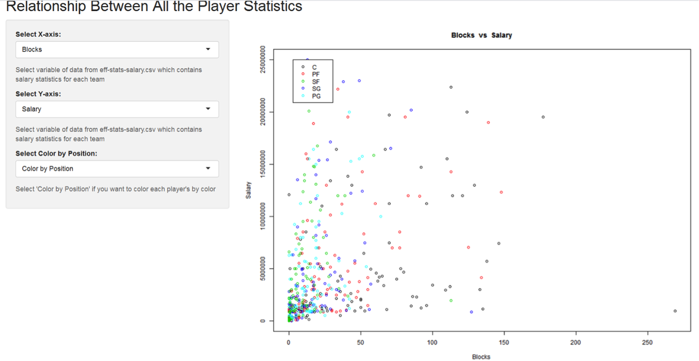
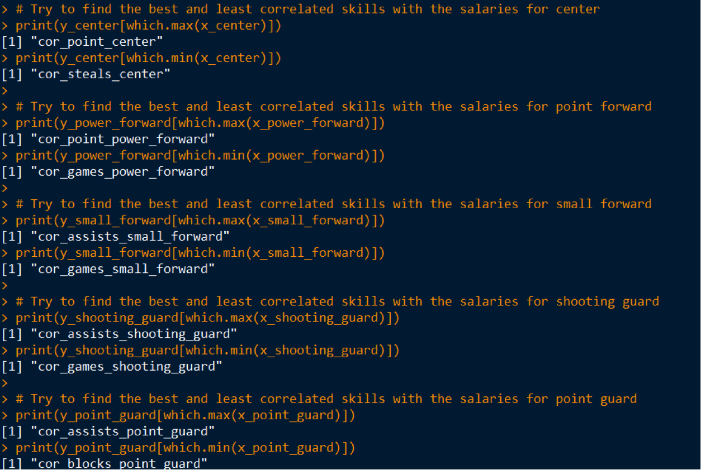

 
 

####**Group members: Seung Soo Kim, Zimei Yuan, Jiyoon Jeong, and Jin Kweon**  

 
 

##**Research Question**

####*In the 2015-2016 season, how do the skills of a player relate to his salary?*
 
 
 
 
##**Abstract & Motivation**  

>This report analyzes what National Basketball Association (NBA) players¡¯ salaries have to do with their performance (performance including many aspects, and we are going to talk about these as well). The motivation is to think of and predict how each team/the NBA sets the salary for each player, based on indicators (we say skills based on how I defined for our project. We defined skills later in our report): games played, age, positions, goals, rebounds, blocks, etc. Throughout the work of the project, our group tried to find out which variables are affecting players' salaries the most. At the end, we also analyze players' value and see if players are getting paid more than their value or less than their value. Our group is formed of four students: Seung Soo, Zimei, Jiyoon, and Jin. We have used R language the most, to come up with the answers. All the files and results are uploaded to Open Science Framework (OSF), with the link following: [osf](osf.io/3nqkp). The types of file extensions are ¡°.R,¡± ¡°.Rmd,¡± ¡°.md,¡± ¡°.txt,¡± ¡°.csv,¡± and ¡°.pdf.¡±

 
 

##**README File**  
>Before we talk about our project, we want to introduce README File beforehand. We want to include a README file to show the general structure of our working directory. The README.md file includes the title (Stat133 Final Project Fall 2016), the authors' names, and a description of this project and the directory-files structure. This README file will let readers know about other files in the directory and therefore see our work clearly. 

 
 

##**Introduction**

>Our analysis are focusing on the following five questions:  

* How can we evaluate the performance of the players? 
* Which skills are more correlated with salary?
* Are there any differences in skills and salary depending on the players' position? 
* Are the players really worth the amounts of money clubs pay for? 
* Are there any undervalued or undervalued players? 

>From these five analytical / exploratory research questions above, our group came up with an answer for the main question of our project: "In the 2015 - 2016 season, how do the skills of a player relate to his salary?"

>Our group divided our work based on our skills. Seung Soo worked on "efficiency" statistics (EFF), Zimei worked on Readme, data dictionaries for each data file, and slides (Jerome also contributed on Readme, data dictionaries, and slides, as well), Clover worked on data acquisition, cleaning, exploratory data analysis (EDA), and Shiny Apps, and Jin worked on Shiny Apps, ggplots, and the report (all other members contributing on the report, as well). 

 
 

##**Data**  
>First of all, NBA is the abbreviation of the National Basketball Association: men's professional basketball league in North America. All the players' performances and salaries are based on the 2015 - 2016 season. And, the main source is the NBA official website: [basketball website](http://www.basketball-reference.com/). In that season, there are thirty teams in the league. So, in total, we acquired 90 raw data files.  
>We developed all the raw data tables for the following three types: roster, totals, and salaries, for each of the thirty teams in the NBA. The names of the teams are following: "Atlanta Hawks (ATL)," "Boston Celtics (BOS), "Brooklyn Nets (BRK)," "Charlotte Hornets (CHO)," "Chicago Bulls (CHI), "Cleveland Cavaliers (CLE)," "Dallas Mavericks (DAL)," "Denver Nuggets (DEN)," "Detroit Pistons (DET)," "Golden State Warriors (GSW)," "Houston Rockets (HOU)," "Indiana Pacers (IND)," "Los Angeles Clippers (LAC)," "Los Angeles Lakers (LAL)," "Memphis Grizzlies (MEM)," "Miami Heat (MIA)," "Milwaukee Bucks (MIL)," "Minnesota Timberwolves (MIN)," "New Orleans Pelicans (NOP)," "New York Knicks (NYK)," "Oklahoma City Thunder (OKC)," "Orland Magic (ORL)," "Philadelphia 76ers (PHI)," "Phoenix Suns (PHO)," "Portland Trail Blazers (POR)," "Sacramento Kings (SAC)," "San Antonio Spurs (SAS)," "Toronto Raptors (TOR)," "Utah Jazz (UTA)," and "Washington Wizards (WAS)."  
>All the rosters tables include the information about roster number, players' names, positions, heights, weights, birth dates, countries born, NBA years of experiences, and colleges attended. All the totals tables include the information about total rank, players' names, ages, games, games started, minutes played, field goals, field goal attempts, field goal percentages, 3-point field goals, 3-point field goal attempts, 3-point field goal percentages, 2-point field goals, 2-point field goal attempts, 2-point field goal percentages, effective field goal percentages, free throws, free throw attempts, free throw percentages, offensive rebounds, defensive rebounds, total rebounds, assists, steals, blocks, turnovers, personal fouls, and points. All the salaries tables include the information about salary ranks, roster players' names, and salaries.  
  
 

**Figure 1.** This is one of the roster table (csv) we  acquired from the 
[link](http://www.basketball-reference.com/)

 

**Figure 2.** This is one of the salary table (csv) we  acquired from the 
[link](http://www.basketball-reference.com/)

 

**Figure 3.** This is one of the totals (stats) table (csv) we  acquired from the 
[link](http://www.basketball-reference.com/)

 

>After we obtained the raw data of each team's records, we removed unnecessary data, edited the data structure and measurements of each variable, and added certain necessary data to the new data frame, to generate 'roster-salary-stats.csv.' The methods we used to acquire cleaned table are described under the section, Methodology.

 

**Figure 4.** This is the part of a cleaned csv (roster-salary-stats.csv). This table includes 39 columns in total: roster numbers, roster players' names, positions, heights, weights, birth dates, countries of birth, NBA years of experiences, colleges attended, salary ranks, salaries, total ranks, ages, games, games started, minutes played, field goals, field goal attempts, field goal percentages, 3-point field goals, 3-point field goal attempts, 3-point field goal percentages, 2-point field goals, 2-point field goal attempts, 2-point field goal percentages, effective field goal percentages, free throws, free throw attempts, free throw percentages, offensive rebounds, defensive rebounds, total rebounds, assists, steals, blocks, turnovers, personal fouls, points, and team names. 

 
 

##**Methodology & Analysis**
>We modified the provided code using loops and creating our own function to avoid repetitive types of codes, and to shorten the lengths of codes. The Data Scraping part is composed of two R scripts, which are ¡®download-data-script.R¡¯ and ¡®download-data-functions.R¡¯ inside of the functions and scripts files, respectively. 
>First, this is the methodology of the data scraping. We extracted each team¡¯s information, such as href attributes, from the anchor tags, and teams¡¯ abbreviations from the specified URL. This part of the code is included in an R script named ¡®download-data-functions.R¡¯, since we need the data such as ¡®team_names¡¯ in ¡®clean-data-script.R¡¯ to load each team¡¯s raw data files by the team¡¯s name. Merely Sourcing ¡®download-data-functions.R¡¯ enables us to get the NBA team¡¯s name in ¡®clean-data-script.R¡¯ without writing the same code to get the team¡¯s name. 
>After we obtained each team¡¯s name and URL for designated data from the previous code, we had to get the information on the roster, salary, and stat table in that URL by recognizing the initial line position of roster, salary, and stat html table. The last line where those three html tables end was obtained by the variable ¡®line_counter¡¯, where it counts the number of lines before </table>.

>After we obtain the first and last line position on the desired html table, we read the information on rosters, salaries, and stats html tables as data.frame. Finally, we export the acquired data frame as a csv file, and name it in the form of ¡®the type of data (roster, salaries, or totals)¡¯-¡®each team¡¯s name¡¯. The purpose of this code is to obtain each team¡¯s csv file, and it is more efficient run by functions, since the same logic (getting the initial and last line of the html table and exporting the table as a csv file) with different arguments (the different file path and name of the different type of tables) applies to all three html tables (roster, salary, and stats). Therefore, function ¡®exportcsv¡¯ is created, and this function is run by ¡®download-data-script.R¡¯ to generate each team¡¯s csv file for three types of data tables. 

>Second, this is the methodology of the data cleaning. 

 

>**-Removed and edited data from raw data**
1.     In salaries. Salary column in Salary csv, $(dollar sign) in front of each player¡¯s salary is removed and the salary data is changed into numeric vectors. 
2.     In roster csv, the original roster.Ht columns¡¯ values is in inches and feet, but we removed dash(-) and changed the measurement to feet. We also changed this column vectors in numeric vectors to make the graph easier to understand, in the Analysis part. 
3.     When we merged all the columns of each data table, we obtained duplicated players, belonging to different teams. Those players¡¯ rows were removed, except for the first row of each player. For example, we have ¡®Alex Stepheson¡¯ who belongs to  LAC, and ¡®Alex Stepheson¡¯ who belongs to MEM, and we just choose the ¡®Alex Stepheson¡¯ who belongs to LAC, since it is the first row that shows data for ¡®Alex Stepheson.¡¯  
4.     We removed the previous column names and added more descriptive column names, in order for us to be able to recognize the data easily.	
 
>**-Added data**
1.     We added a new column, called ¡°Team¡±, since we need to arrange players by the names of their teams, to draw the graph in Shiny App (team-salaries) and obtain information in ¡°eda-script.R.¡± 
 
>**-Joined data**
1.     First, we merged roster table data and salaries table data, which are ordered by players¡¯ names. We saved this data into the variable called ¡®a.¡¯
2.     Secondly, we merged the data ¡®a¡¯ with the stats table data, which are also ordered by players¡¯ names, and we got the merged data of the three tables. 

>For exploratory data analysis (in eda-script), we divide up quantitative and qualitative variables. The qualitative variables in our csv file are four in total: "player name," "position," "birth date," "country origin," "colleges players graduated," and "teams." The other 33 are all quantitative, such as roster number, height, weight, salary, etc. With quantitative variables, there are some special cases we have to modify for some columns. For example, the experience column has "R", and the three-point field goal percentage has "NA," and to make R program consider it numeric, we decided to make "R" and "NA" equal to zero (0) - there is either no information, or players have no experience in the columns.

 

Here is an example below:  

 

**Figure 5.** This picture shows one of the examples that some columns include a character while most of the elements are numeric. 

 

>In this R script, we used ¡®sink¡¯ (function in R) eda-output.txt to save minimum, median, tenth / twenty-five / seventy-five / ninety quartiles, inter-quartiles, maximum, minimum, median, standard deviation, range, difference (between the biggest and smallest numbers), and sums for quantitative variables in eda-output.txt. Most of the time, we used for-loop to get summaries for each column.

 

Here is one of the examples for for-loop below:

 

**Figure 6.** This picture is part of the codes how we used for-loop to get statistics for some variables.

 

**Figure 7.** This is part of the ¡®eda-output.txt,¡¯ including all the statistics.

  Also, we made some graphs, but there are some variables that we did not use in the graphs: roster number, player name, birth date, salary rank, and total rank. We skipped them because those variables have nothing to do with the skills of the players. Quantitative variables are interpreted with histograms and boxplots (and summary statistics in eda-output.txt), and qualitative variables are interpreted with bar-charts (and frequency tables in eda-output.txt). For every bar-chart, we displayed them horizontally, for visual purposes.

 

Here are some of the ggplots we got below:

**Figure 8.** Here is one of the bar charts, displaying the counts of the teams.

**Figure 9.** Here is one of the box plots, displaying the data (IQR, quartiles, media, etc) for three point field goals.

**Figure 10.** Here is one of the histograms, displaying the counts of three point field goals.

>**PCA** 
The original efficiency formula is offense oriented, so defensive players might seem less efficient compared to those who have offensive position. In order to balance the efficiency between offensive and defensive players, we applied Principal Component Analysis(PCA) to the original efficiency.

>**Modified EFF**
In order to calculate the efficiency for each position, we classified the cleandata by players' position, and added missing records(missed free throws, missed field goals, turnovers). Also, I divided records(points, assists, steals etc) by the number of played game to see the efficiency per game. The modified efficiency was obtained by multiplying each variable with coefficient that is derived by PCA. To standardize the coefficient(weight), we divided the coefficient by a standard deviation of each position. So the modified EFF formula is the sum of coefficient * variables(per game) / standard deviation.

>"eff-stats-salary.csv" consists of 14 columns (refer the picture below). The efficiency index is the modified efficiency we obtained by using PCA.

 

  
**Figure 11.** This is part of the ¡°eff-stats-salary.csv.¡± We added an extra column, ¡®position¡¯ for Shiny app ¡°stat-salaries.¡±

>Shiny App shows the correlation between two variables easily. For example, in the Shiny App image below, we can see how total points and salary are positively correlated. Also, we see that most of the players are distributed between 0 and 300 points, regardless of their positions. 

  
**Figure 12.** This is one of the Shiny pictures: showing the relationship between total points and salary.

 

>"best-worst-value-players.txt" consists of 5 columns(index number, player's name, position, value, identify). We picked top 20 and bottom 20 players among all players by ordering the value. Value of a player is obtained by a formula that is efficiency divided by salary.

**Figure 13, 14.** This is picture of the ¡°best-worst-value-players.txt,¡± showing the 20 most and worst value players.

>>>>####*From now on, we answered the five main questions below for analysis:*  

 

>>>####**1. How can we evaluate the performance of the players?**

We calculated applied modified efficiency by using PCA to standardize the indicator, because the original formula is offensive position oriented.
Formula = (w1*PTS + w2*REB + w3AST + , , + w8*TO) / GP, (w1~w8 are weights)

>######Efficiency of center
Nazr Mohammed has the lowest efficiency (0.6529) among all center players. DeMarcus Cousins has the highest efficiency (12.294) among all center players. The median efficiency of centers is 3.6299, and the mean is 4.0088.
 
>######Efficiency of power forward
Branden Dawson has the lowest efficiency (0.3678) among all power forward players. Draymond Green has the highest efficiency (11.5831) among all power forward players. The median efficiency of power forwards is 3.6971, and the mean is 4.0242.
 
>######Efficiency of small forward
Sam Dekker has the lowest efficiency(0.304) among all small forward players. LeBron James has the highest efficiency (11.149) among all small forward players. The median efficiency of power forwards is 3.474, and the mean is 3.878.
 
>######Efficiency of shooting guard
Luis Montero has the lowest efficiency (0.6448) among all shooting guard players. James Harden has the highest efficiency (13.7412) among all shooting guard players. The median efficiency of power forwards is 4.1755, and the mean is 4.5777.
 
>######Efficiency of point guard
Bryce Cotton has the lowest efficiency (0.0477) among all point guard players. Russell Westbrook has the highest efficiency (10.7583) among all point guard players. The median efficiency of power forwards is 3.67313, and the mean is 4.14635.

 

>>>####**2. Which skills are more correlated with salary?**

>Our group defines skills as all the nine elements that consist of EFF. From the Shiny App "stat-salaries," we can find some skills that have something to do with salaries, as follows: total points, total rebounds, assists, steals, missed field goals, and turnovers. However, some skills barely have relationships with salaries, as follows: blocks, missed free throws, and games played. These decisions are purely made through our observation (filtering out the skills that are likely to correlate with salary, before finding the correlations) of the graphs on Shiny App "stat-salaries." For example, when you see the relationship between blocks and salaries below, most of the dots are concentrated near the origin, and many players have big gaps in salary, even though they have similar blocking numbers.

 

  
**Figure 15.** This is one of the Shiny app showing the relationship between blocks and salary. (show how each skill is correlated with salary)

 

After, our group tried to make relationships between skills (including the unlikely related skills, as well, to make sure our visual predictions were correct) and salaries.
We concluded that cor_ point most correlated with salary, with the value of 0.6400 rounded to. And, the least correlated skill with salary was cor_blocks, with the value of 0.3589 rounded to. 

We concluded that cor_point most correlated with salary, with the value of 0.6400 rounded to. And, the least correlated skill with salary was cor_blocks, with the value of 0.3589 rounded to. 

 

**Figure 16.** This is the table of the correlation for every skill.

 

Most correlated with salary, in ascending order, are the following:

* cor_blocks (blocks)
* cor_games (games played)
* cor_ missed_ free_throws (missed free throws)
* cor_steals (steals)
* cor_assists (assists)
* cor_rebounds (rebounds)
* cor_turnovers (turnovers)
* cor_ missed_ field_goals (missed field goals)
* cor_point(point)

**Figure 17.** These are some of the regressions between salary and other skills.

 

>>>####**3. Are there any differences in skills and salary depending on the players' position?**  

>We came up with the most and least correlated skills with the salaries, for each position. By seeing how each position is related to skill, we could tell how each position requires different skills. First of all, the center's salary has the most correlation with points, and the least correlation with steals. Second, the point forward's salary has the most correlation with points, and the least correlation with games. Third, the small forward's salary has the most correlation with assists, and the least correlation with games. Fourth, the shooting guard's salary has the most correlation with assists, and the least correlation with games. Last, the point guard's salary has the most correlation with assists, and the least correlation with blocks. From this analysis, definitely, points and assists are the important factors for every player in every position, for earning a higher salary, and the number of games they played is not that significant a factor.  

**Figure 18.** It shows the most and least correlated skill of each position.

 

>>>####**4. Are the players really worth the amount of money clubs pay for?**

**Figure 19, 20.** These two show regression between EFF and salary to check worthiness of salary. The first graph includes the regression line in the plot graphs, and the second graph distinguish each plots based on their positions. 

>We made two graphs to see if players are worthy of their salary: a plot graph with a regression line, and a colored plot graph based on positions. We assume that the regression line indicates the adequate line between salary and efficiency. Although most of the players are positioned close to the regression line, there are some outliers. As the above graph shows, the numbers above and below the regression line are similar. The points above the line are considered "worthier" players than the clubs pay for, and the points below the line are considered "less worthy" players than the clubs pay for. It is easily shown in the position-colored graph that many centers and small forwards (and slightly the point forwards) are less worthy, and many shooting guards (and slightly the point guards) are worthier. This graph indirectly shows that most of the forwards are earning much higher salaries than the guards who have similar stats.   

>>>####**5. Are there any undervalued or overvalued players?**  

>The value of player is defined by the efficiency and salary. If a player gets paid more than his efficiency, we can consider him as an overvalued player. Conversely, if a player gets paid less than he should, we can consider him as an undervalued player. We have already calculated the value that is efficiency divided with the salary, and the volume of values represent whether the player is getting too much money or too less money. In order to sort undervalued and overvalued players, I ordered all players by the their value and extracted 30 players with top 30 values and 30 players with bottom 30 values.
 

**Figure 21.** It is the list of under-valued players.

**Figure 22.** It is the list of over-valued-players.
 
  
 
 ***Note:*** All the codes for the analysis are belong to the compute-efficiency-script.R script. 
 
 
 

##**Result**

>The interesting thing we found is that most of the positions¡¯ salaries have the least correlation with the number of games they played. It is interesting that the games they played barely have nothing to do with their salaries. The games they played are great proof, from the players in any sport, that they are important in the team; thus, we would expect the more frequently they play, the higher salaries they earn. However, the result turned out to be opposite. 

>The main result is that players with a relatively high efficiency have a higher salary than other players with a lower efficiency do. In general, salary is determined by a player¡¯s performances. One interesting and surprising thing is among the 20 worst valuable players, 9 of them are position ¡°center¡±. (We can see this fact from the best-worst-value-players.txt). Generally, one of the obvious patterns is that players with high salaries have higher efficiency and better performance. The PCA and EFF formula we used to calculate the efficiency are the core of this project. They contribute to help us analyzing data comprehensively. 

>Also we were surprised that the most related factor was total point among all positions, although three out of five positions showed that the number of assists was the most related factor. Thus, we assume that the total point of power forward and center has a higher influence the correlation than the number of assist does. When we do data analysis in the future, we may still need to use methods similar to what we have used in this project. 
 
 
 
 
##**Conclusion** 
>We found that points, missed field goals, and rebounds are the top three correlation factors for salary; however, blocks, games played, and missed free throws are the bottom three correlation factors for salary in general. Although we do not consider position a skill, we did find that position is one of the biggest factors that affects the salary of the players. Each player¡¯s position has different skills that are most / least correlated with their salaries. Here, we found that points and assists are important factors for their salaries, but the number of games played is not that related to salary. We found that shooting guards have the highest efficiency, and point guards have the lowest efficiency. Finally, there are many shooting forwards who are worthier than what they are paid, and many centers and small forwards that are less worthy than what they are paid. As a result, our analysis would be beneficial to the owner of basketball team. The analysis will provide the value of each player, so that the owner can set the amount of salary strategically. However, we are wondering if top three skills that are highly related to the amount of salary are also related to the percentage of victories. In the future, we would like to investigate the factors that influence the percentage of winning, because the ultimate goal of a game would be winning the game. Also, the owner of a team will be able to reward players properly through our analysis.

>From our analysis, although there is a positive relation between players' salaries and their performance and skills, i.e. usually players who get higher salaries have better performances than other players do, such as more total points, and fewer missed field goals and missed free throws, there do exist some exceptions. In the pictures in Shiny App we have shown before, there are some players who have a high salary but who have missed a lot of field goals, and some players who earn an average or low salary actually perform well. So basketball teams should use an accurate statistical method to analyze players' performances as a standard to determine their salaries. They need to see which players are more or less worthy than the others, and distribute salaries more properly.

##**Reference**
[link for reference](http://www.basketball-reference.com/)  
@bball_ref. "Basketball Statistics and History | Basketball-Reference.com."   
Basketball-Reference.com. SPORTS REFERENCE LLC, 2016. Web. 27 Nov. 2016.

