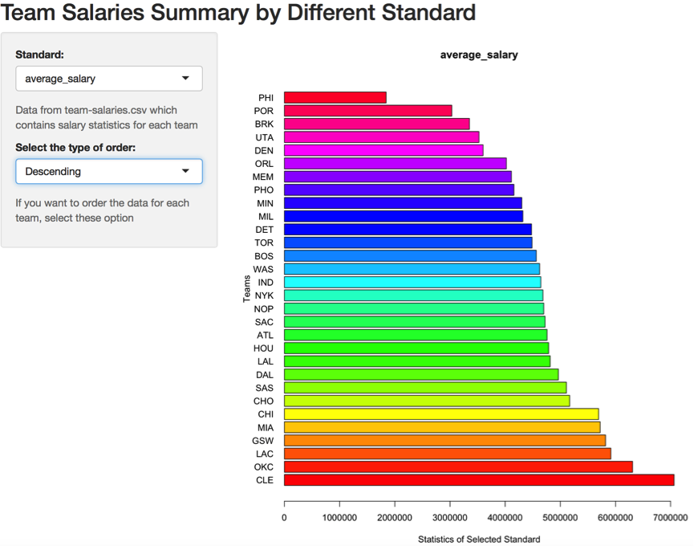

```{r setup, include=FALSE}
knitr::opts_chunk$set(echo = FALSE)
```

## Abstract
The final project involves analyzing data about basketball players from 
NBA League in the 2015-2016 season.  


The motivation question is : <div class="blue">*"In the 2015-2016 season, 
how do the skills of a player relate to his salary?"*


</div>

## We start from data acquisition and data cleaning
There are three kinds of raw data tables : *Roster, Totals, Salaries*  

*Steps we do here:*
<div class="black">
1. scrape the three kinds of tables and get 90 raw data files  

2. produce roster-salary-stats.csv file, which contains all variables from Roster,   
Totals and Salary.  

3. write auxiliary cleaning functions
</div>                                                       
----


</div>
Picture of code we use to scrape and download data  

## Continue  

</div>  

## Exploratory Data Analysis
<div class="black">
Two aspects of analysis : Qualitative amd Quantitative

Qualitative variables:player's name, birth date, country, team, position, etc.

Quantitative variables: mean, median, min, standard deviation, etc.

</div>

## Example of Qualitative analysis
   
bar chart of counts of positions   

----

    
bar chart of counts of number of players in each team

## Examples of Quantitative analysis
This is part of eda-output.txt file

</div>
----  
This histogram shows the frequency of field goals.                          
  
</div>
----  

We can see that the highest frequency of salary centered around 2000000.


## Shiny App for "team-salaries"
#### This bar chart shows the minimum salary for each team in ascending order. We can see that LAL is the team with highest minimum salary.
  

----
This bar chart shows the total payroll for each team in ascending order.  


</div>
----

This bar chart shows the average salary for each team in descending order. 

</div>
----
This bar chart shows the standard deviation of salary for each team in 
ascending order. 

</div>
----
This bar chart shows the first quantile of salary statistics for each 
team in descending order 


</div>

## Analyze performace of players by using Eff Model
<div class="black">
Old Eff formula = (PTS + REB + AST + STL + BLK - Missed FG - Missed FT - TO) / GP

Only favors offense-oriented players. Not good!
</div>

So we use:  
<div class="blue">
 New EFF = w1x1/std1 + ...w8x8/std8, where xj is the j-th variable, 
 j = 1,2,...,8, wj is the weight for variable j = 1,2,...8, stdj is 
 the standard deviation of variable j = 1,2,...,8
</div>
----
Table "eff-stats-salary.csv", which contains efficiency statistics and other important variables  
For position "PF". Same thing for other positions. 
<div align = "center">

</div>
## Shiny app "stat-salaries"
<div class="black">
Positive relation between total points and salary
</div>
<div align = "center">

</div>
----
The picture shows the relation between salary and missed free throws. 

<div align = "center">

</div>
There are a few outlier data, which indicate that some players missed 
a lot of free throws although they get a very high salary.  
## Calculate the value of a player
<div class="blue">
Formula: value = efficiency/salary. We want to identify the top 20 players
(most valuable) and the bottom 20 players(worst value)
</div>
Here is a picure of most valuable and least valuable players:
<div align = "center">

</div>


## Conclusion from our analysis of this project:
<div class="black">
  From our analysis, although there is a positive relation between players' 
salary and their efficiency, there are some players who have high salaries but missed a lot of field goals, and some players who earn average or low salaries actually perform well. So basketball teams should use
an accurate statistical method such as PCA and modified EFF formula to analyze players' performances as one of standards
to determine their salary.
</div>

